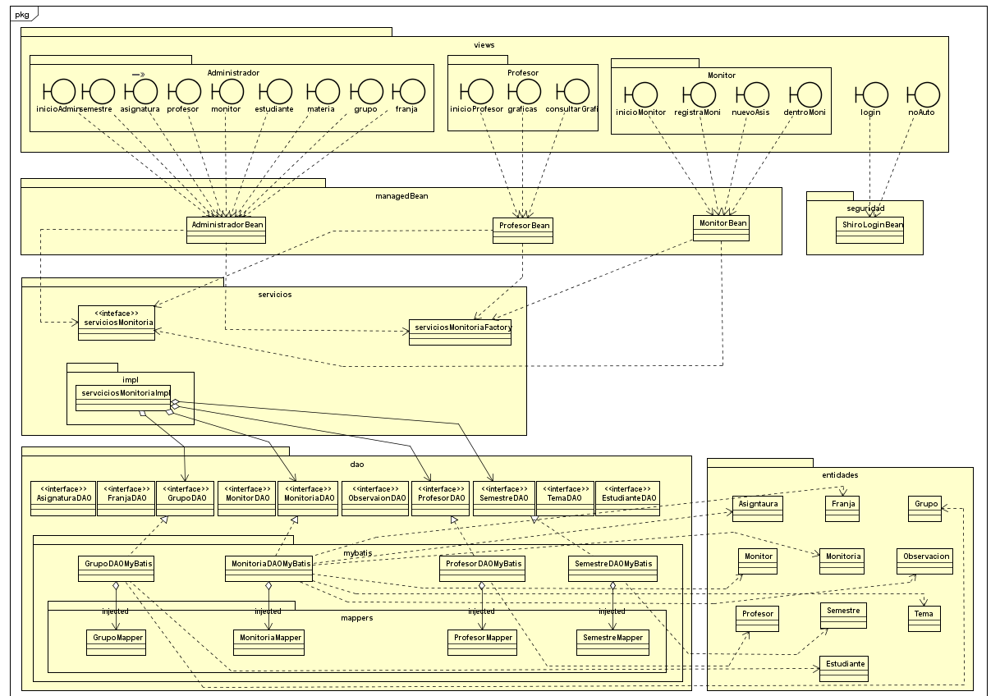
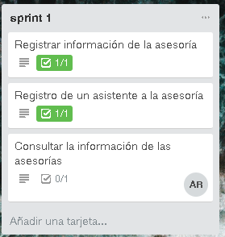
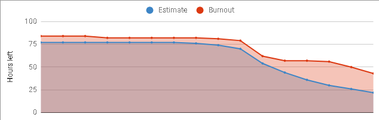
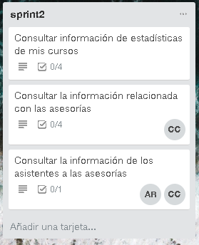
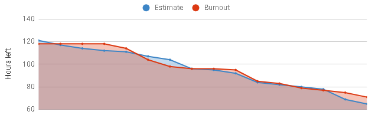
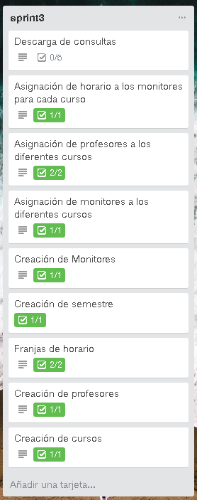
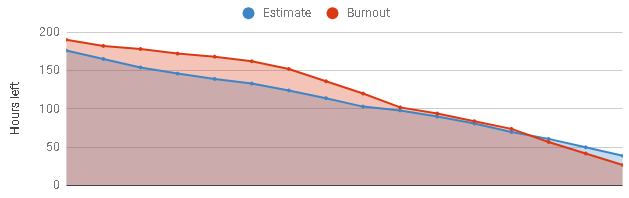

***Monitorias académico de estudiantes de Pregrado de la Escuela Colombiana de Ingeniería Julio Garavito***
======
*Proyecto desarrollado en el periodo académico 2018-1 por MonitoriasSAS para el curso Procesos de Desarrollo de Software (PDSW)*

Integrantes de MonitoriasSAS:
  -------
  * Carlos Andrés Castañeda Lozano
  * Nicolas Patiño Parra
  * Sergio Alejandro Peña Pinto
  * Andrés Rodríguez del Toro
  * Alejandro Rodríguez del Toro
  
Profesor:
  -------
  ##### Francisco Jose Chaves Alonso
  
****Información General:****
======
 
  *Roles:*
  -------
  #### ****Stakeholder:****
  ##### Wilmer Edicson Garzón Alfonso
  
  #### ****Dueño de producto:****
  ##### Francisco Jose Chaves Alonso
    
  #### ****Scrum Master:****
  #####  Carlos Andres Castañeda Lozano - c.castañeda 
    
  #### ****Team:****
 
  + Carlos Andres Castañeda Lozano - c.castañeda
  + Nicolas Patiño Parra - n.patiño
  + Sergio Alejandro Peña Pinto - s.peña
  + Andres Rodriguez del Toro - a.rodriguez
  + Alejandro Rodriguez del Toro - a.toro
    
    
Descripción del producto:
  -------
  
  
## *Descripción General:*
Es una herramienta que ha contribuido a una mejora significativa en el desempeño de los estudiantes del programa de Ingeniería de Sistemas de la Escuela, en las asignaturas de primeros semestres administradas por el mismo. El sistema, más allá de facilitar el seguimiento de la labor de los monitores, se ha convertido en una valiosa base de conocimiento con la que los coordinadores de asignaturas y de línea pueden identificar aquellos temas que a través del tiempo han presentado mayores dificultades a los estudiantes. Con esto, ha sido posible organizar, de forma más estratégica, la toma de acciones a nivel pedagógico, didáctico y administrativo que han redundado en un mejoramiento general del desempeño de los estudiantes.

## *Funcionalidades:*

Arquitectura y Diseño Detallado:
  -------
## *Modelo E-R:*
 
     
## *Diagrama de Clases:*  
 

## *Arquitectura:*
La plataforma de gestión a servicios de Monitorias Académicas divide su funcionamiento en cuatro capas:

***Persistencia:*** La capa de persistencia empieza su funcionamiento en una base de datos utilizando PostgreSQL. Seguido por una extracción de los datos, y una transformación por medio de un mapper con el Framework de MyBatis, para trasformar lo que se extrae a objetos, para finalmente llevarlos a la capa de aplicación.

***Aplicación:*** La capa de aplicación se encarga de procesar los objetos obtenidos después de la capa de persistencia, para finalmente poder entregar lo que se requiere en la capa de vistas. Todo empieza en una clase de servicio en la cual se establecen todas las diferentes funciones que tiene toda la aplicación, para recoger los datos que se encuentran en los distintos DAOS y extraerlos en objetos. Estos objetos están constituidos por las diferentes entidades en que se encuentran como: asignatura, estudiante, franjaHorario, grupo, monitor, monitoria, observacion, profesor, semestre, tema.

También es de gran importancia el uso del patrón de método fabrica, y las inyecciones de Google Guice para acoplar estas diferentes capas, así estas se pueden adaptar a cualquier software que ya esté montado en la institución.

***Vistas:*** Esta capa involucra el uso de PrimeFaces, mejorando la capacidad de las vistas, y aprovechando las distintas herramientas, para brindar la mejor experiencia al usuario al momento de usar la plataforma. También es de gran importancia el uso de ManagedBeans los cuales manejan todos los datos que son usados en las vistas, estos son los que conectan esta capa con la lógica.

***Seguridad:*** La capa de seguridad se hace gracias al uso de Apache Shiro el cual ayuda a restringir las diferentes vistas a sus correspondientes roles, también se cuenta con una protección que evita que se pueda ingresar desde el link si no pertenece al rol indicado. 

## *URL Heroku:*
https://monitoriassas.herokuapp.com/

## *Integracion Continua*

## *Analisis de Codigo*

Descrpción del Proceso:
  -------
  
## *Metodología:*
La metodología usada fue un conjunto de buenas prácticas, las cuales ayudaron a la buena organización en el desarrollo del proyecto, haciéndolo de forma ágil. El uso del Framework Scrum ayudó a la administración del proceso, fortaleciendo la comunicación entre los integrantes, y mejorando la planificación para cada una de las entregas.

Todo el proceso de desarrollo empezó con una visión del producto que elabora el stakeholder, sin embargo lo que no es de prioridad se filtra por el Dueño del producto el cual produce un backlog (anexo) en el cual en forma de historias de usuario se plantean los requerimientos que debe tener la aplicación.

Ese backlog es lo que se intenta cumplir cada temporada de trabajo, las cuales fueron tres, cada una con una duración de aproximadamente quince días, estas temporadas son denominadas Sprints las cuales inician con una reunión en la cual se analiza cada tarea que está en el backlog.

En el proceso no se realizaron reuniones Daily Standup ya que el ambiente académico no lo permitía, sin embargo, ocurrían reuniones de corto tiempo frecuentemente, para ir analizando la situación en la que el equipo se encontraba.

Al momento de hacer la entrega con el Dueño del producto se tienen en cuenta los diferentes comentarios que se hacen, y se tienen como objetivo para futuros Sprints, finalmente se hace una reunión de retrospectiva con la que podemos sacar conclusiones de la temporada que ha pasado y así finalizar el ciclo con una retrospectiva, antes de empezar nuevamente con otro Sprint.

## *Trello:*

https://trello.com/b/PepJZUrX/2018-1-proypdsw-monitoriassas

## *Sprint 1:*

### Descripción del Sprint:
El primer sprint concluyó de una manera adecuada, durante este tiempo se elaboró la estructura necesaria para el proyecto, además se logró tener un producto entregable para la fecha acordada, sin embargo, los últimos días antes de la entrega tuvimos un trabajo que excedió lo que habíamos planeado, ya que tuvimos grandes cambios en la estructura de la plataforma. En general tuvimos un buen desempeño donde todo el equipo trabajó constantemente y con un punto de vista de entregar un buen producto; la comunicación fue clave en este aspecto para lograr mezclar las cuatro ramas en un gran proyecto.
### Sprint-backlog:

### Sprint-burndown Chart:

### Reporte GIT Sprint 1:

## *Sprint 2:*
### Descripción del Sprint:
Este Sprint no terminó con los resultados esperados, en este periodo aunque se le trabajó el tiempo que se tenía disponible, las demás materias afectaron mucho al tiempo que se tenía destinado al proyecto y finalmente se redujo en gran parte el trabajo que se le hizo en esta temporada, sin embargo se hicieron grandes avances en la parte logica y de los servicios, con esto pensamos que nos facilitará la parte visual en el proximo Sprint.
### Sprint-backlog:

### Sprint-burndown Chart:

### Reporte GIT Sprint 2:

## *Sprint 3:*
### Descripción del Sprint:
En este ultimo sprint se buscaba tener lo que se había propuesto en un inicio, poder finalizar toda la plataforma con sus funciones, lo cual se completó en una gran parte, el tiempo en esta temporada fue mucho mayor, sin embargo, la cantidad de trabajo era mucho mayor, ya que en el Sprint 2 no se completaron varias tareas claves. La comunicación en equipo, y el trabajo constante fueron la clave para desarrollar este proyecto de la mejor manera.

Para este punto el trabajo era superior al tiempo que realmente íbamos a tener disponible, así que fue necesario un trabajo mucho mayor, dedicado y organizado para cumplir con el objetivo propuesto.
### Sprint-backlog:

### Sprint-burndown Chart:

### Reporte GIT Sprint 3:

## *Reporte de Pruebas:*
