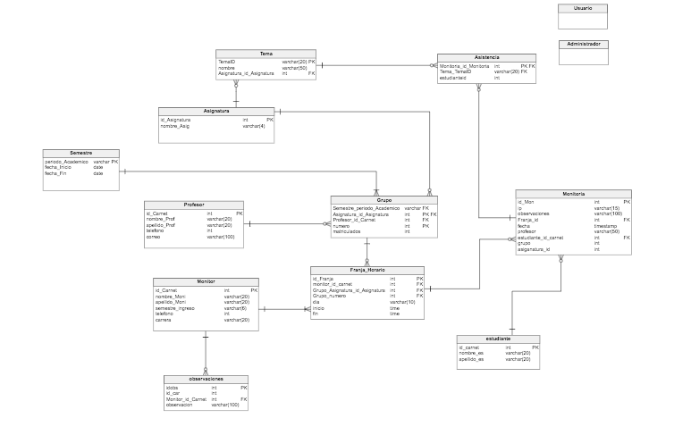

***Monitorias académico de estudiantes de Pregrado de la Escuela Colombiana de Ingeniería Julio Garavito***
======
*Proyecto desarrollado en el periodo académico 2018-1 por MonitoriasSAS para el curso Procesos de Desarrollo de Software (PDSW)*

Integrantes:
  -------
  * Carlos Andrés Castañeda Lozano
  * Nicolas Patiño Parra
  * Sergio Alejandro Peña Pinto
  * Andrés Rodríguez del Toro
  * Alejandro Rodríguez del Toro
  
Profesor:
  -------
  ##### Francisco Jose Chaves Alonso
  
****Información General:****
======
 
  *Roles:*
  -------
  #### ****Stakeholder:****
  ##### Wilmer Edicson Garzón Alfonso
  
  #### ****Dueño de producto:****
  ##### Francisco Jose Chaves Alonso
    
  #### ****Scrum Master:****
  #####  Carlos Andres Castañeda Lozano - c.castañeda 
    
  #### ****Team:****
 
  + Carlos Andres Castañeda Lozano - c.castañeda
  + Nicolas Patiño Parra - n.patiño
  + Sergio Alejandro Peña Pinto - s.peña
  + Andres Rodriguez del Toro - a.rodriguez
  + Alejandro Rodriguez del Toro - a.toro
    
    
Descripción del producto:
  -------
  
  
## *Descripción General:*
Es una herramienta que ha contribuido a una mejora significativa en el desempeño de los estudiantes del programa de Ingeniería de Sistemas de la Escuela, en las asignaturas de primeros semestres administradas por el mismo. El sistema, más allá de facilitar el seguimiento de la labor de los monitores, se ha convertido en una valiosa base de conocimiento con la que los coordinadores de asignaturas y de línea pueden identificar aquellos temas que -a través del tiempo- han presentado mayores dificultades a los estudiantes. Con esto, ha sido posible organizar, de forma más estratégica, la toma de acciones a nivel pedagógico, didáctico y administrativo que han redundado en un mejoramiento general del desempeño de los estudiantes.

Modelo de Bases de Datos:
  -------
  
  

## *URL Heroku:*
https://monitoriassas.herokuapp.com/

 ## *Retrospectiva:*
 
   

## *Integracion Continua*

## *Analisis de Codigo*

 
